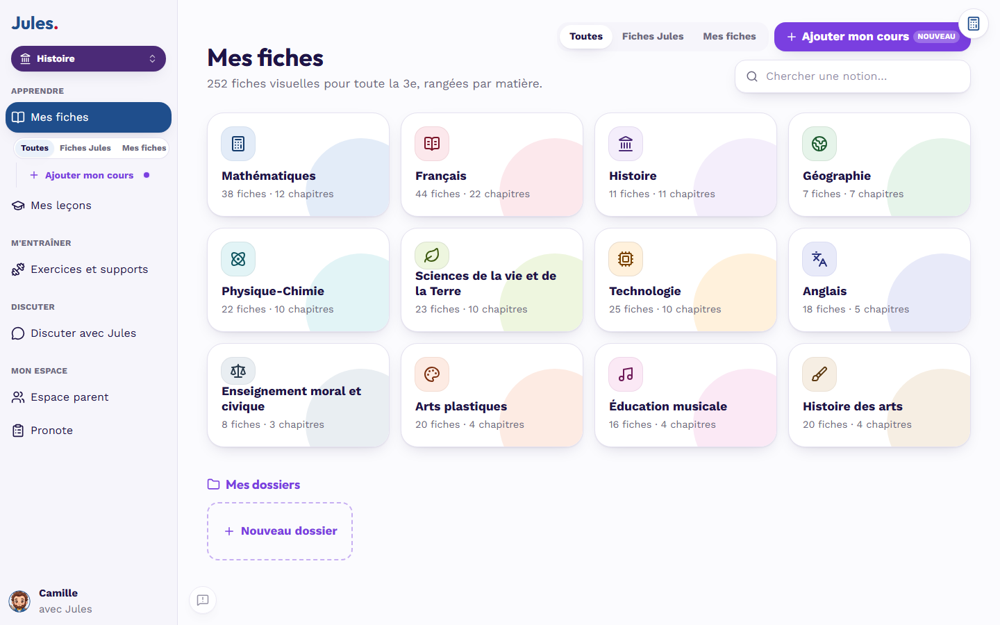

# Bibliothèques de Jules

**Les fiches de [Jules](https://github.com/alexxb2mg-svg/jules), le tuteur libre qui guide l'élève sans jamais donner la réponse. Écrites par la communauté, vérifiées par le code, relues par des enseignants.**

Ce dépôt contient deux sortes de fiches, une par notion du référentiel de Jules (**683 notions** : CM1, 5e, 4e, 3e) :

- les **fiches v2** : l'essentiel du cours, la méthode, les erreurs fréquentes et des exercices que le programme **corrige lui-même**, avec trois indices gradués et des pièges. Jules peut ainsi aider un élève sans aucune IA, gratuitement, pour tout le monde ;
- les **fiches visuelles** : un condensé illustré de la notion (carte des notions, formule, schéma, méthode, piège classique, exemple concret), affiché dans la page « Mes fiches » de Jules, là aussi sans appel au modèle d'IA.

<p align="center"></p>
<p align="center"></p>
<p align="center"><em>Les fiches de ce dépôt dans la nouvelle interface de Jules (profil d'exemple, moteur Démo).</em></p>

## Où en est le chantier

| Niveau | Notions | Fiches v2 vérifiées | Fiches visuelles |
|---|---:|---:|---:|
| CM1 | 158 | 158 | 158 (10 matières) |
| 5e | 132 | 0 | 0 |
| 4e | 141 | 0 | 0 |
| 3e | 252 | 252 | 247 (12 matières) |
| **Total** | **683** | **410** | **405** |

Toutes ces fiches sont **vérifiées par le code** (`jules fiches verifier` pour les fiches v2, `outils/verifier_visuelles.py` pour les fiches visuelles, relancés par la CI à chaque pull request). **Aucune n'a encore été relue par un enseignant.** Le détail notion par notion est dans [CHANTIER.md](CHANTIER.md).

## Appel à contributions

C'est un chantier de bénévoles. Il reste deux grands besoins :

- **générer** les fiches v2 de **5e et de 4e** (273 notions), puis leurs fiches visuelles ;
- **relire** les fiches déjà vérifiées : c'est là que les **enseignants** sont très attendus (voir la section « Relire » de [CONTRIBUER.md](CONTRIBUER.md)).

Chacun peut donner un peu de temps et les crédits de son abonnement à une IA :

1. **Choisir** une ou plusieurs notions « à faire » dans le tableau de bord [CHANTIER.md](CHANTIER.md).
2. **Réserver** avec un ticket [« Je réserve des notions »](../../issues/new?template=reservation.yml).
3. **Générer** : `jules chantier paquet <notion>` donne un texte à coller dans l'IA de votre choix (Claude, Mistral, ChatGPT, Albert...). Pour une fiche visuelle : `jules chantier visuel`, puis `jules chantier apercu` pour la voir.
4. **Vérifier** : `jules fiches verifier` dit ce qui manque ; on corrige jusqu'à « Conforme. ». Pour les fiches visuelles : `python outils/verifier_visuelles.py --jules ../jules fiches-visuelles-<niveau>`.
5. **Proposer** : une pull request. Un enseignant relira ensuite.

Le pas à pas est dans [CONTRIBUER.md](CONTRIBUER.md). Pas besoin d'être enseignant pour générer une fiche.

Une notion déjà prise peut recevoir d'autres générations, comme **propositions** : un relecteur choisira la meilleure ou les fusionnera.

## Contenu

| Dossier | Type | Niveau | Fiches |
|---|---|---|---:|
| `fiches-v2-cm1/` | fiches v2 | CM1 | 158 |
| `fiches-v2-5e/` | fiches v2 | 5e | 0 / 132 |
| `fiches-v2-4e/` | fiches v2 | 4e | 0 / 141 |
| `fiches-v2-3e/` | fiches v2 | 3e | 252 |
| `fiches-visuelles-cm1/` | fiches visuelles | CM1 | 158 |
| `fiches-visuelles-3e/` | fiches visuelles | 3e | 247 |
| `outils/` | vérificateur des fiches visuelles | | |

Chaque dossier est une bibliothèque au sens de Jules ([format](https://github.com/alexxb2mg-svg/jules/blob/main/bibliotheque/README.md), [contrat des fiches v2](https://github.com/alexxb2mg-svg/jules/blob/main/docs/FICHES-V2.md), [format des fiches visuelles](https://github.com/alexxb2mg-svg/jules/blob/main/bibliotheque/SCHEMA-FICHE-VISUELLE.md)) :

```
fiches-v2-3e/
  bibliotheque.yaml
  fiches/<matiere>/<notion>.yaml                    # la fiche servie par Jules
  propositions/<matiere>/<notion>/<pseudo>.yaml     # d'autres générations, jamais servies, en attente de choix

fiches-visuelles-3e/
  bibliotheque.yaml                                 # type: fiches-visuelles
  fiches/<matiere>/<notion>.yaml                    # la fiche, en blocs
  fiches/<matiere>/<notion>.svg                     # ses schémas, s'il y en a
```

## Utiliser ces fiches avec Jules

```bash
git clone https://github.com/alexxb2mg-svg/jules-bibliotheques   # à côté du dossier de Jules
```

puis, dans `config.local.yaml` de Jules : `bibliotheques_externes: ["../jules-bibliotheques"]`. Le `config.yaml` de Jules déclare déjà ces bibliothèques (module `exercices` pour les fiches v2, module `fiches_visuelles` pour les fiches visuelles) : seules celles du niveau de l'élève sont chargées. Voir [docs/CHANTIER.md](https://github.com/alexxb2mg-svg/jules/blob/main/docs/CHANTIER.md).

## Avertissement

Contenu **expérimental**, généré par IA à partir du référentiel officiel et de sources libres citées dans chaque fiche. Chaque fiche est vérifiée par le code, mais tant que `relecture.statut` n'est pas `relue`, aucun enseignant ne l'a relue : elle peut contenir des erreurs, et l'élève voit la mention « fiche expérimentale ». Le cours de l'élève et la parole de son professeur font toujours foi.

## Licence

Les fiches sont sous [CC BY-SA 4.0](LICENCE.md). Chacune cite ses sources, qui doivent être libres ([SOURCES.md](SOURCES.md)). Le code de Jules est sous MIT, dans [son propre dépôt](https://github.com/alexxb2mg-svg/jules).
